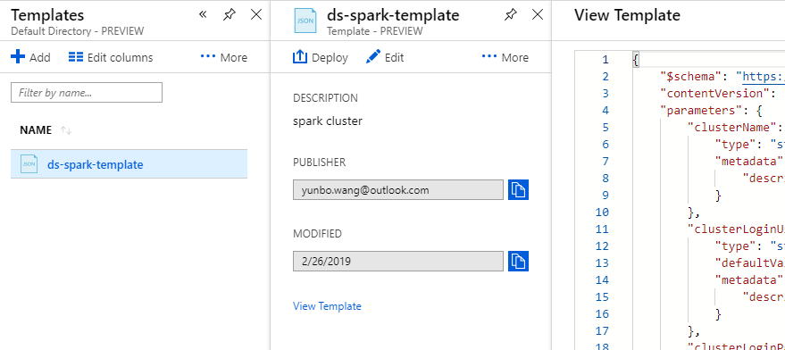
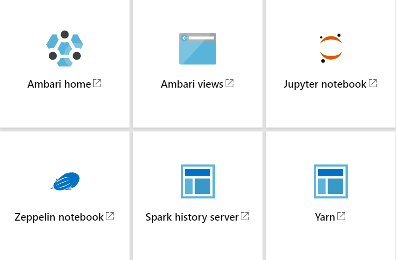

## Solution 1
### Description
- Provisioning infrastructure based on Azure [HDInsight](https://azure.microsoft.com/en-us/services/hdinsight/)
- Spark cluster
- 2 head nodes and 2 worker nodes

| TYPE | SIZE | CORES | NODES |
| -----|----- | ------|------ |
| Head |D12 v2|8      |2      |
|Worker|D13 v2|16     |2      |

### Procedure
- go to [Azure template page](https://portal.azure.com/#create/Microsoft.Template)
- build your own template in the editor with [this content](https://github.com/xydata/ds-workspace/blob/master/spark-cluster-template-std.json)
- save the user/password for later use
- deploy the cluster using the template

- the deployment process takes 20 minutes
- verify the deployment by accessing different entry points of Cluster dashboards

- send the URLs and user/password of Zepplin and Jupyter to end user
```
Dear User,

Your Spark Cluster has been successfully created. Please find hereunder the access information 
in order to benifit the power of the Computing Plateforme:

- Zepplin URL: https://ds-cluster04.azurehdinsight.net/zeppelin
- Jupyter URL: https://ds-cluster04.azurehdinsight.net/jupyter/tree
- User Name: admin
- Passwrod : xxxxxx

Regards,

Big Data Support Team
```
