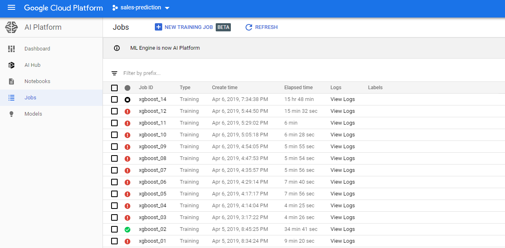
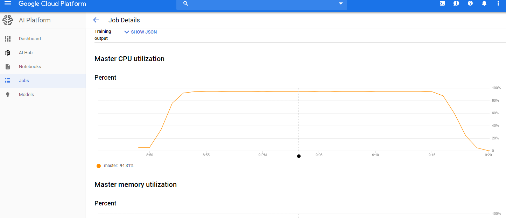

## Solution 1
### Description
- prepare data and train models on Google's [AI Platform](https://cloud.google.com/ml-engine/docs/)
- support sklearn, xgboost and tensorflow
- computing power is [highly configurable](https://cloud.google.com/compute/docs/machine-types#predefined_machine_types)
### Procedure
- use [this example](https://github.com/iyunbo/sales-prediction/tree/master/trainer) as template for summiting a job for either:
  - preparation
  - training
- go to [this URL](https://console.cloud.google.com/mlengine/) for job monitoring
- the choice of computing power is configurable via [this file](https://github.com/iyunbo/sales-prediction/blob/master/config.yaml)



### Cost estimation

the cost of the service depends on:
- the chosen machine types: m
- the size of whole cluster: n
- the duration of the running job: t

assuming we use n1 machines of type m1, n2 machines of type m2, the total duration of jobs on both m2 and m1 is t hours, the total cost is
```
Price(m1) x n1 x t + Price(m2) x n2 x t
```
